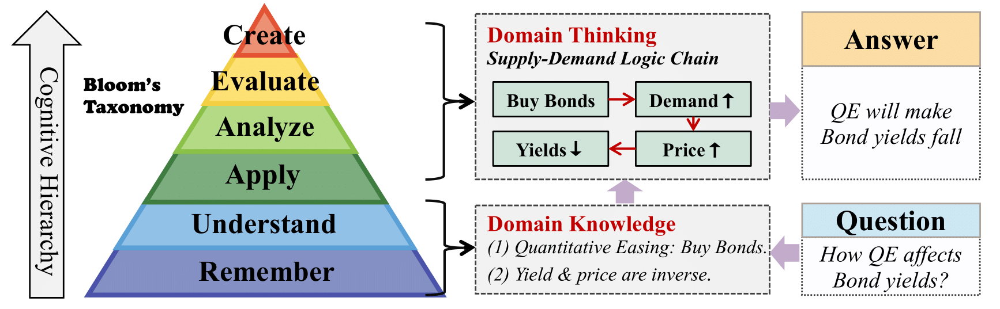
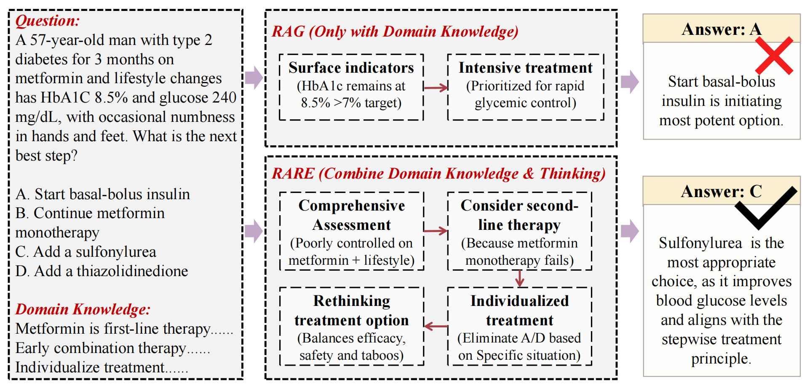

<h1 align="center">   RARE: Retrieval-Augmented Reasoning Modeling </h1>

## 💡 Overview

We propose the **RARE** training framework, a novel paradigm that decouples knowledge storage from reasoning modeling. This framework accelerates reasoning modeling via bypassing rote memorization of lower-level knowledge. At present, we have made available several materials pertinent to the *medical and legal domains, as well as open-domain multi-modal scenarios. (Work in Progress)* 

<table class="center">
    <tr>
        <td width=100% style="border: none"></td>
    </tr>
    <tr>
        <td width="100%" style="border: none; text-align: center; word-wrap: break-word">
              Motivation of RARE. Left: A pyramid-shaped Bloom’s Taxonomy, illustrating the cognitive hierarchy from basic "Remember" to advanced "Evaluate" and "Create" levels. Right: The correspondence between Domain Knowledge and Domain Thinking with Bloom’s cognitive hierarchy (example related to government bond yields). In contrast to domain knowledge, domain thinking corresponds to the higher-order cognitive process—although relatively <strong>rare</strong>, it plays a crucial role.
      </td>
    </tr>
</table>

<table class="center">
    <tr>
        <td width=100% style="border: none"></td>
    </tr>
    <tr>
        <td width="100%" style="border: none; text-align: center; word-wrap: break-word">
              Demonstration of RARE. A real data sample, which showcases the effectiveness and superiority of RARE.
      </td>
    </tr>
</table>

<!-- ## 📣 Latest News -->

## 🔧 Installation

Complete the environment deployment for this project through the following methods.

```
git clone https://github.com/Open-DataFlow/RARE
cd RARE

conda create -n rare python=3.10
conda activate rare

pip install -r requirements.txt
```

## 🏃 Quick Start

We provide two complete examples, one for pure language and one for visual-language tasks.

- Train with [PubMedQA](https://arxiv.org/abs/1909.06146) (text-only dataset) 
```
bash demo/llama_pubmedqa_rare.sh
```

- Train with [MM-RAIT](https://arxiv.org/abs/2502.17297) (multi-modal dataset)
```
bash demo/qwenvl_mmrait_rare.sh
```

## ✨ Preliminary Experiments

### 📋 Data Preparation

We provide methods for preprocessing data from different sources.

1. Format Original Data <a id="step1"></a>

- process medqa and pubmed

```
python process/process_medqa.py
python process/process_pubmed.py
```
- process pubhealth
```
python process/process_pubhealth.py
```
- process casehold
```
python process/process_casehold.py
```
- process mmrait
```
huggingface-cli download whalezzz/M2RAG --repo-type dataset --local-dir process --include "fact_verify/*"
python process/process_mmrait.py
```
Through the above steps, the construction of prompts and answers for the dataset has been completed.


2. Distill Reasoning Model
```
# For medqa, pubmed, pubhealth, casehold, these steps should be done
modelscope download --model Qwen/QwQ-32B --local_dir saves/QwQ-32B
python inference/vllm_infer_text.py --model_name_or_path saves/QwQ-32B --dataset_path data/train_medqa.json --template qwen
python process/select_true.py data/train_medqa.json # Only for medqa and casehold

# For mmrait, these steps should be done
modelscope download --model Qwen/Qwen2.5-VL-32B-Instruct --local_dir saves/Qwen2.5-VL-32B-Instruct
python scripts/vllm_infer_mm.py --model_name_or_path saves/Qwen2.5-VL-32B-Instruct --dataset_path data/train_mmrait.json
python process/select_true.py data/train_mmrait.json --mm
```

After preprocessing, the data should include at least the following keys, where 'instruction', 'predict', 'id', and 'output' represent the prompt, the teaching model's thought process and answer, the data identification number, and the standard answer to the question, respectively.

```
{
      "instruction": str,
      "predict": str,
      "id": str，
      "output"： str
}

# or multimodal data:
{
      "messages": list,
      "images": list,
      "id": str，
      "output"： str
}
```


### 🏋️‍♂️ Model Training

Our training code supports the types of models, and here are some examples of their specific names.

- meta-llama/Llama-3.1-8B-Instruct
- Qwen/Qwen2.5-7B-Instruct
- mistralai/Mistral-7B-Instruct-v0.3

You need to modify the value of the fsdp_config parameter to correspond to different models. If you wish to select more different models, you can choose to use llamafactory to start training or modify the code in train/sft.py

- Training using only text datasets (medqa, pubmed, pubhealth, casehold)
```
bash train/sft.sh
```

- Training with multimodal datasets (mmrait)
```
accelerate launch --config_file train/accelerate_config_mm.yaml train/train.py train/training_args_mm.yaml

python saves/mmrait-qwenvl/zero_to_fp32.py saves/mmrait-qwenvl  --safe_serialization  # Convert deepspeed checkpoints
```

### 🔮 Model Inference

Our inference script supports five types of models, and here are some examples of their specific names.

- meta-llama/Llama-3.1-8B-Instruct
- Qwen/Qwen2.5-7B-Instruct
- mistralai/Mistral-7B-Instruct-v0.3
- deepseek-ai/DeepSeek-R1-Distill-Llama-8B
- Qwen/Qwen2.5-VL-7B-Instruct

For the test set, at least [step 1](#step1) of preprocessing should be completed, including questions and standard answers.
Parameters that are strongly recommended to adjust include model_name_or_path, dataset_path, template, prediction_key, and tensor_parallel_size, which represent the model path, dataset path, prompt template (corresponding to the pre-trained model), the key name where inference results are saved in the dataset, and the number of parallel processes (corresponding to the number of your GPUs).

```
python inference/vllm_infer_text.py  --model_name_or_path saves/medqa-llama --dataset_path data/test_medqa.json --template llama --prediction_key llm_predict_rare_llama --tensor_parallel_size 8

# multimodal
python inference/vllm_infer_mm.py --model_name_or_path saves/mmrait-qwenvl --dataset_path data/test_mmrait.json --prediction_key llm_predict_rare_qwen2vl --tensor_parallel_size 4
```

<details>

<summary> API Inference </summary>

---------

You can also use API calls to test closed-source models for baseline methods (e.g., RAG). Below is an example that uses the POST method to call the API for inference. You need to specify the model name, your API URL and key, the dataset path, and the number of concurrent workers.
```
python inference/api_infer_post.py --model_name 'your_model_name' --api_url 'your_api_url' --api_key 'your_api_key'  --dataset_path data/test_medqa.json --concurrency 30
```
Then, you can use the exact same method for evaluation. Note that you need to set `--prediction_key` to the name of the model you used. 

```
python eval/eval.py --file data/test_medqa.json --prediction_key 'your_model_name'
```
---------

</details>

### 📊 Output Evaluation

The inference script extracts the keys to be evaluated through regular expressions and compares them with the standard answers, ultimately calculating the accuracy.

```
python eval/eval.py --file data/test_medqa.json --prediction_key llm_predict_rare_llama
```

